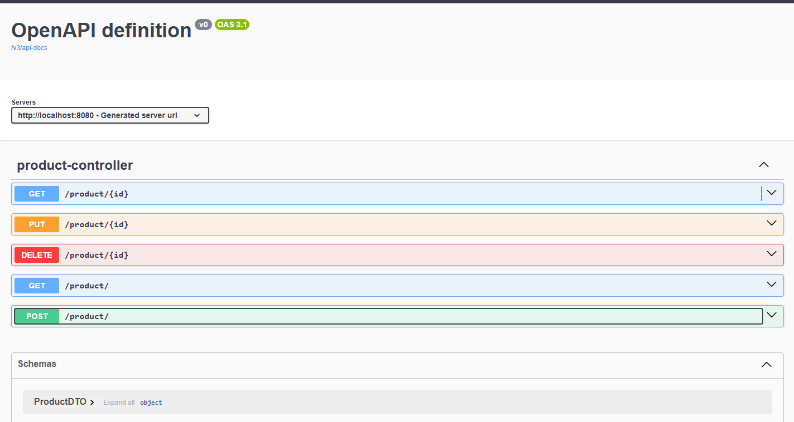

# Simple Crudh with Swagger

---

This is a simple project that I made to review some very basic concepts and apply Swagger (SpringDoc) to API documentation

---

## Swagger Documentation for the Endpoints

